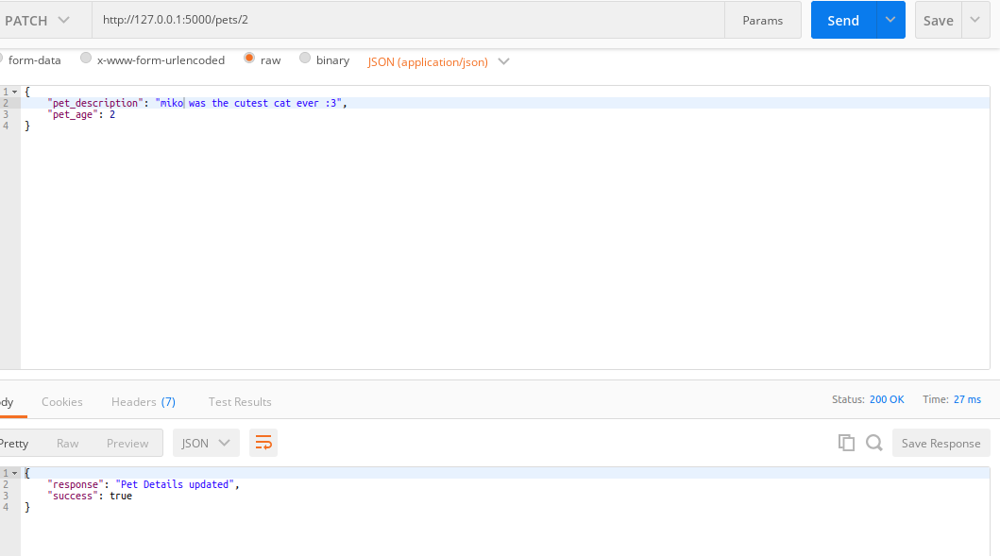
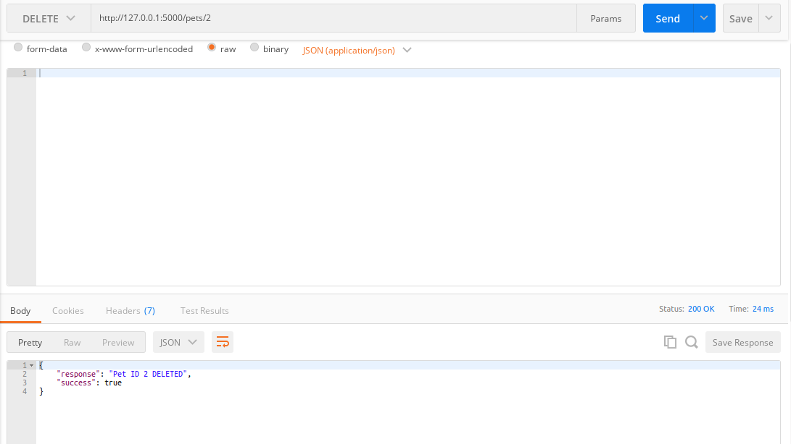

# CURD API Pets
API using Flask framework to store your pets to database. The purpose of this app to complete LSP Course from Gunadarma University.

# Requirements
- Python 3.8
- PostgreSQL Server
- Docker Compose
- Docker

# Installation

## Local
To use this program you must install the required package using this command
```bash
pip3 install requirements.txt
```
## Docker (Recommended)
You can also install using docker container. To build this app, you can run command.

```bash
docker build -t <your_image_name>:<tag> .
```

# Prepare Database
## Install PostgreSQL
You can install your own postgreSQL server or you can follow this command below.
```bash
docker pull postgres:14.1-alpine # pull docker image.

```
## Run PostgreSQL Image
You can run your postgreSQL image with this command.
```bash
docker run --name postgresql -e POSTGRES_USER=haikal -e POSTGRES_PASSWORD=password -p 5432:5432 -v /data:/var/lib/postgresql/data -d postgres
```
## Prepare Database
Before you run this API, you must create postgresql database like example below.
----
First, go into your container.
```bash
docker exec -it postgres /bin/bash
```
----
Next, Go into your postgreSQL CLI
```bash
su postgres # run this
```
----
Next, Prepare The Role
```bash
CREATE ROLE haikal WITH LOGIN PASSWORD 'password';
```
----
Check your role using this command.

```bash
\du
# Example output:
                                   List of roles
 Role name |                         Attributes                         | Member of 
-----------+------------------------------------------------------------+-----------
 haikal    |                                                            | {}

```
----
Then, Create the Database.
```bash
CREATE DATABASE db_pets;
```
----
After that, you can grant access of database to the saved role.
```bash
GRANT ALL PRIVILEGES ON DATABASE db_pets TO haikal
```
----
You can check your database using this command.
```bash
\l
# Example Output:
                                 List of databases
   Name    |  Owner   | Encoding |  Collate   |   Ctype    |   Access privileges   
-----------+----------+----------+------------+------------+-----------------------
 db_pets   | postgres | UTF8     | en_US.utf8 | en_US.utf8 | 
 postgres  | postgres | UTF8     | en_US.utf8 | en_US.utf8 | 
 template0 | postgres | UTF8     | en_US.utf8 | en_US.utf8 | =c/postgres          +
           |          |          |            |            | postgres=CTc/postgres
 template1 | postgres | UTF8     | en_US.utf8 | en_US.utf8 | =c/postgres          +
           |          |          |            |            | postgres=CTc/postgres
(4 rows)
```
----

# How to Run?

You can run the apps using this command line below.

```bash
docker-compose up
```
Tada, you can go to your http://127.0.0.1:5000 to check your online API

# How to Use API?

## Create (url/pets)

To add the data to database, you need to add the payload request like example below
```json
{
	"pet_name": "embul",
	"pet_type": 1,
	"pet_description": "embul was the cutest cat ever",
	"pet_age": 3
}
```
If succeed, it will return this response.

```json
{
    "response": "Pet added",
    "success": true
}
```
 


## Read (url/getpets)
You can read the list of pets in your database using GET method. Here's the example output.
```json
{
    "pets": [
        {
            "pet_age": 3,
            "pet_description": "embul was the cutest cat ever",
            "pet_id": 3,
            "pet_name": "embul",
            "pet_type": "cat"
        },
        {
            "pet_age": 3,
            "pet_description": "embul was the cutest cat ever",
            "pet_id": 4,
            "pet_name": "embul",
            "pet_type": "1"
        },
        {
            "pet_age": 2,
            "pet_description": "embul was the cutest cat ever :3",
            "pet_id": 2,
            "pet_name": "miko",
            "pet_type": "cat"
        }
    ],
    "success": true,
    "total_pets": 3
}
```

 

## Update (url/pets/<pet_id>)
You can update the pet using PATCH method. Here's the example payload and the example output.
```json
{
	"pet_description": "miko was the cutest cat ever :3",
	"pet_age": 2
}
```

Output
```json
{
    "response": "Pet Details updated",
    "success": true
}
```

 
## Delete (url/pets/<pet_id>)

You can delete the element of the database using this url.

Output 
```json
{
    "response": "Pet ID 4 DELETED",
    "success": true
}
```

 